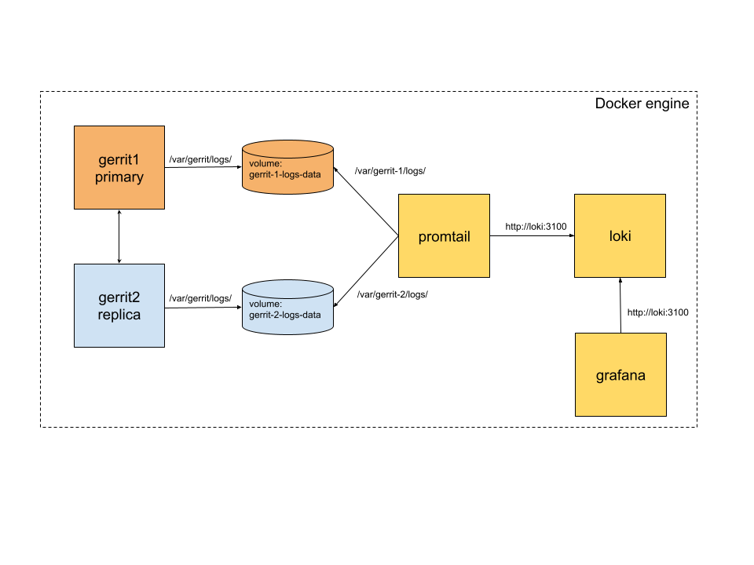
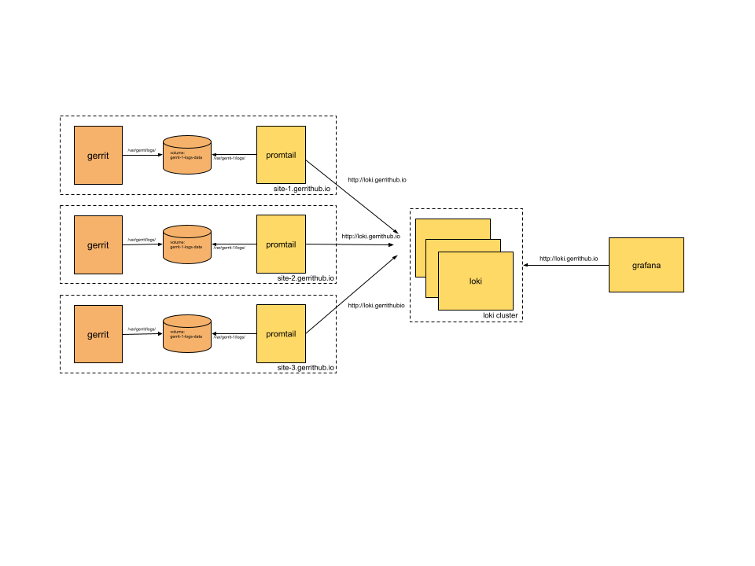

# Problem

Currently `review.gerrithub.io` does not provide a centralised platform to analise the logs. For
that reason everytime the is an outage, engineers needs to ssh into the different nodes to check
the logs.

# Logs in Gerrit

The logs in json can be configured in Gerrit adding this configuration in the `etc/gerrit.config`:

```
[log]
    jsonLogging = true
```

Each Gerrit instance produces the following logs files:

- error_log.json
- httpd_log.json
- sshd_log.json
- pull_replication_log

## error_log.json

This file will contain structure logs as:

```
{
  "@timestamp": "2023-11-08T17:36:18.122Z",
  "source_host": "172.24.0.3",
  "message": "hooks.projectCreatedHook resolved to /var/gerrit/hooks/project-created [CONTEXT project=\"test-1\" request=\"REST /projects/*\" ]",
  "file": "HookFactory.java",
  "line_number": "62",
  "class": "com.googlesource.gerrit.plugins.hooks.HookFactory",
  "method": "getHookPath",
  "logger_name": "com.googlesource.gerrit.plugins.hooks.HookFactory",
  "mdc": {},
  "ndc": "",
  "level": "INFO",
  "thread_name": "HTTP PUT /projects/test-1 (admin from 172.24.0.1)",
  "@version": 2
}
```

## httpd_log.json

This file will contain structure logs as:

```
{
  "host": "192.168.208.1",
  "thread": "HTTP-120",
  "user": "admin",
  "timestamp": "2023-11-07T18:54:15.345Z",
  "method": "GET",
  "resource": "/accounts/self/detail",
  "protocol": "HTTP/1.1",
  "status": "200",
  "content_length": "275",
  "latency": "15",
  "cpu_total": "13",
  "cpu_user": "10",
  "memory": "310400",
  "user_agent": "Mozilla/5.0 (Macintosh; Intel Mac OS X 10_15_7) AppleWebKit/537.36 (KHTML, like Gecko) Chrome/117.0.0.0 Safari/537.36"
}

```

## sshd_log.json

This file will contain structure logs as:

```
{
  "timestamp": "2023-11-01T16:06:48.245Z",
  "session": "682182e4",
  "thread": "sshd-SshDaemon[18f37d6e](port=22)-nio2-thread-4",
  "user": "admin",
  "account_id": "a/1000000",
  "message": "LOGIN FROM 127.0.0.1"
}
```

## pull_replication_log

Plugins (as far as I know) does not provide structure logs.

```
[2023-11-07 18:53:36,428] Ref event received: CREATE on project test-1:refs/meta/config - 0000000000000000000000000000000000000000 => fe01ae9d3a5e8bfabf31b02887fc626703d672b4
[2023-11-07 18:53:36,432] RevisionData is {commitObject=fe01ae9d3a5e8bfabf31b02887fc626703d672b4 (COMMIT) treeObject=537ab9e414cd82d953805d589180813f33c693b2 (TREE) blobs=[a782fcaf8f8f413d313e58d4f0238e214800328c (BLOB)]} for test-1:refs/meta/config
```

# Purpose of the POC

The concept behind this Proof of Concept (POC) is to design an experiment
aimed at retrieving logs from various Gerrit instances within the topology
and presenting them in a more user-friendly manner.

# Components

It is important to mention that the Gerrit instalation chose for this experiment
is Gerrit primary/replica with pull-replication plugin.

The components are the following:

- **Gerrit primary**: logs are emitted in a mounted volume `gerrit-1-logs-data`.

- **Gerrit replica**: logs are emitted in a mounted volume `gerrit-2-logs-data`.

- **Grafana Loki stack**:

    - **[Promtail](https://grafana.com/docs/loki/latest/send-data/promtail/)**: responsible for tailing, processing, and
      shipping log data to Loki.

    - **[Loki](https://grafana.com/docs/loki/latest/)**: designed for storing and querying large volumes of log data.

    - **[Grafana](https://grafana.com/)**: open-source, multi-platform data visualization and monitoring tool
      used for creating interactive and customizable dashboards.

The architecture would be the following:



## Promtail

**Log data targets:**

| Instance       | Log data type    | Format | Location                                |
|----------------|------------------|--------|-----------------------------------------|
| Gerrit Primary | error            | json   | /var/gerrit-1/logs/error_log.json       |
| Gerrit Primary | httpd            | json   | /var/gerrit-1/logs/httpd_log.json       |
| Gerrit Primary | sshd             | json   | /var/gerrit-1/logs/sshd_log.json        |
| Gerrit Primary | pull replication | text   | /var/gerrit-1/logs/pull_replication_log |
| Gerrit Replica | error            | json   | /var/gerrit-2/logs/error_log.json       |
| Gerrit Replica | httpd            | json   | /var/gerrit-2/logs/httpd_log.json       |
| Gerrit Replica | sshd             | json   | /var/gerrit-2/logs/sshd_log.json        |
| Gerrit Replica | pull replication | text   | /var/gerrit-2/logs/pull_replication_log |

**Labels or metadata:**

| Instance       | Log data type    | Static Labels                                                    | Dynamic Labels  |
|----------------|------------------|------------------------------------------------------------------|-----------------|
| Gerrit Primary | error            | environment = test, instance = primary, type = error             | level           |
| Gerrit Primary | httpd            | environment = test, instance = primary, type = httpd             | method, status  |
| Gerrit Primary | sshd             | environment = test, instance = primary, type = sshd              | user            |
| Gerrit Primary | pull replication | environment = test, instance - primary, type = pull-replication  |                 |
| Gerrit Replica | error            | environment = test, instance = replica, type = error             | level           |
| Gerrit Replica | httpd            | environment = test, instance = replica, type = httpd             | method, status  |
| Gerrit Replica | sshd             | environment = test, instance = replica, type = sshd              | user            |
| Gerrit Replica | pull replication | environment = test, instance - primary, type = pull-replication  |                 |


# LogQL

[LogQL](https://grafana.com/docs/loki/latest/query/) is the query language used by Grafana.

## Log queries:

### Http requests to list the changes has been unauthorized in the primary node?

```
{type="httpd", instance="primary", method="GET", status="401"} | json | resource=`/a/changes/`
```

### Http requests to list the changes has been successful in the primary node?

```
{type="httpd", instance="primary", method="GET", status="200"} | json | resource=`/a/changes/`
```

### Http requests to create a change in the primary node ?

```
{type="httpd", instance="primary", method="POST"} | json | resource=`/a/changes/`
```

### Ssh requests to create a branch by the user-2 in the primary node ?

```
{type="sshd", instance="primary"} | json | user = `user-2` |= `create-branch`
```

### Ssh requests to create a project by the user-1 in the primary node ?

```
{type="sshd", instance="primary"} | json | user = `user-1` |= `create-project`
```

### Errors in the primary node ?

```
{type="error", instance="primary", level="ERROR"} | json
```

### Warnings in the primary node ?

```
{type="error", instance="primary", level="WARN"} | json
```

### Pull-replication Logs in the replica node ?

```
{type="pull-replication", instance="replica"} | logfmt | __error__=``
```

### Pull-replication init project requests in the replica node ?
```
{type="httpd", instance="replica", method="PUT"} |  json | resource!="init-project"
```

## Metric queries:

### Count all the GET Http requests in primary instance in the last five minutes

```
count_over_time({type="httpd", instance="primary", method="GET"}[5m])
```

### Count all the ERROR logs in primary instance in the last five minutes

```
count_over_time({type="error", level="ERROR", instance="primary"}[5m])
```

### Per-second rate of all POST HTTP requests within the last minutes per instance.

```
sum by (instance)(rate({type="httpd",method="POST"}[1m]))
```

# Logs in gerrithub.io



Deploying Grafana Loki in a production environment requires careful consideration to ensure stability, performance, and security. Here are some key factors to take into account:

1. **Hardware/Resources:**
    - Ensure sufficient CPU, RAM, and storage resources for Loki, considering expected workloads.

2. **Scaling:**
    - Plan for horizontal scalability to accommodate growing log volumes.

3. **High Availability:**
    - Design a redundant deployment across nodes or availability zones for minimized downtime.

4. **Storage Backend:**
    - Choose an appropriate storage backend aligned with infrastructure and performance needs.

5. **Retention Policies:**
    - Define and configure log retention policies for storage and query performance considerations.

6. **Security:**
    - Implement TLS for communication, authentication, and authorization mechanisms to control access.

7. **Backup and Recovery:**
    - Establish a backup and recovery strategy to prevent data loss in case of failures.

8. **Monitoring and Alerting:**
    - Set up monitoring and alerting for key metrics using Grafana and Prometheus.

9. **Log Ingestion Rate:**
    - Adjust configurations to handle expected log ingestion rates, considering peak loads.

10. **Network Considerations:**
    - Ensure proper network connectivity, firewall rules, and security policies.

11. **Updates and Maintenance:**
    - Plan for regular updates, patches, and maintenance to keep the system up-to-date.

12. **Documentation and Training:**
    - Provide documentation and training to ensure the team is familiar with the Grafana Loki stack.

13. **Testing:**
    - Thoroughly test the setup in a staging environment before deploying in production.

14. **Compliance:**
    - Ensure the deployment aligns with specific compliance requirements, such as GDPR or HIPAA.

# Some references

- [Grana stack getting started docker example](https://github.com/grafana/loki/tree/main/examples/getting-started)
- [Grana stack production docker example](https://github.com/grafana/loki/tree/main/production/docker)
